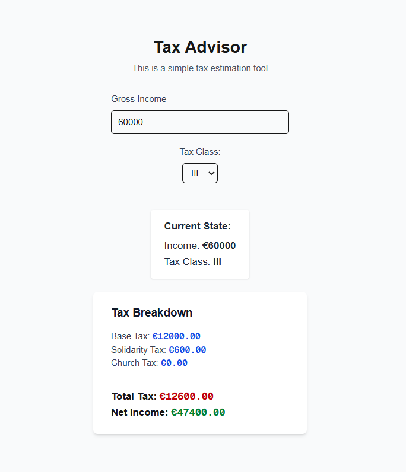

```md
# Tax Advisor

A simplified **tax advisor web application** built with **Next.js App Router**, **React**, **TypeScript**, **Zustand**, and **TanStack Query**, focusing on **clean state separation** and **real-world frontend architecture**.

---

##  Tech Stack

- **Next.js 14+ (App Router)**
- **React**
- **TypeScript (Strict Mode)**
- **Zustand** – Global client-side state management
- **TanStack Query (React Query v5)** – Server state management & caching
- **Tailwind CSS** – Minimal styling
- **Zod** – Runtime schema validation for user input and API responses


---

## Screenshot



##  What This Project Demonstrates

- **Clear separation of client state and server state**
- Proper use of **Zustand** for user-entered data
- Proper use of **TanStack Query** for API data and caching
- Use of **derived state** instead of storing calculated values
- Modern **Next.js App Router** architecture
- Type-safe design using **TypeScript**

---

## Screenshot


## 📌 Application Overview

The application allows users to enter basic tax-related information such as:
- **Annual gross income**
- **Tax class**
- **Marital status**
- **Church tax applicability**
- **Health insurance type**

Based on these inputs and predefined tax rules fetched from an API, the app calculates:
- **Estimated income tax**
- **Solidarity surcharge**
- **Church tax (if applicable)**
- **Estimated net income**

---

## 🧠 Architecture & Data Flow

The application follows a clean and scalable architecture:

### **Zustand (Client State)**
- Stores all **user-entered form data**
- Used for global, client-side state
- Does **not** store server data or calculated values

### **TanStack Query (Server State)**
- Fetches tax rules from a mock API
- Caches server data efficiently
- Handles loading and error states

### **Derived State**
- Tax calculations are computed using **pure utility functions**
- No calculated values are stored in global state

### **Next.js API Routes**
- Provide a mock backend for tax rules
- Simulate real-world server data fetching

### **Zod (Runtime Validation)**
- Validates API responses before they enter the app
- Ensures user input is safe before calculations
- Complements TypeScript with runtime guarantees


---

##  Getting Started

### Install dependencies
```bash
npm install
````

### Run the development server

```bash
npm run dev
```

Open **[http://localhost:3000](http://localhost:3000)** in your browser.

---

## ⚠️ Important Notes

* Tax calculations are **not legally accurate**
* This project focuses on **frontend architecture and state management**
* No authentication or database is implemented

---

## 📚 Learning Focus

This project was built as a focused learning exercise to understand:

* Modern **Next.js App Router** patterns
* **Global state vs server state**
* **Derived state** and pure functions
* Scalable frontend application design

---

## 📄 License

This project is for **educational purposes only**.

```

